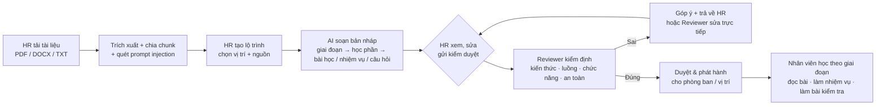
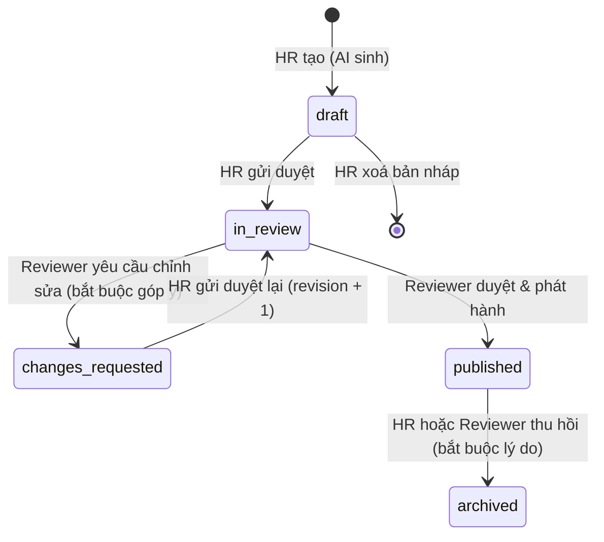

# SkillSprint AI — Frontend: chức năng, luồng thực hiện và các thay đổi

> Cập nhật: 25/09/2026 · Phụ trách: Phạm Tấn Tài (Fullstack) · Mã nguồn: `frontend/`

---

## 1. Sản phẩm này là gì

SkillSprint AI **không phải** web quản lý nhân sự. Đây là nền tảng biến tài liệu nội bộ của công ty thành **lộ trình học** cho từng vị trí:

- HR tải lên tài liệu công ty: chính sách, SOP, sổ tay, mô tả công việc (PDF, DOCX, TXT, MD, CSV).
- AI dựng lộ trình gồm các giai đoạn, học phần, bài học, nhiệm vụ nghiệp vụ và bài kiểm tra.
- Lộ trình phục vụ hai nhóm: **nhân viên mới hội nhập**, hoặc **nhân viên thăng chức** cần thêm kiến thức nghề.
- Reviewer kiểm duyệt từng lộ trình trước khi phát hành cho nhân viên.

### Ba vai trò

| Vai trò | Làm gì | Trang chính |
| :--- | :--- | :--- |
| **HR** | Tải tài liệu. Cấu hình yêu cầu của từng vị trí. Cho AI tạo lộ trình. Sửa theo góp ý. Gửi duyệt. | `/hr/*` |
| **Reviewer** (kiểm duyệt) | Kiểm tra lộ trình AI tạo: đúng kiến thức, đúng luồng, đúng chức năng của vị trí. Nếu đúng: **duyệt và phát hành cho phòng ban / vị trí**. Nếu sai: **góp ý, trả về HR**, hoặc **sửa trực tiếp**. | `/reviewer/*` |
| **Nhân viên** | Nhận lộ trình theo phòng ban và vị trí. Đọc bài học và tài liệu gốc. Làm nhiệm vụ. Làm bài kiểm tra. | `/employee/*` |

Đăng nhập demo: trang `/login` → nhập email + mật khẩu (hoặc bấm chip tài khoản demo để điền sẵn):

| Vai trò | Email | Mật khẩu | Trang chính |
| :--- | :--- | :--- | :--- |
| HR | `hr@fourangrybirds.vn` (Jordan Lee) | `Demo@123` | `/hr/dashboard` |
| Người duyệt (Reviewer) | `reviewer@fourangrybirds.vn` (Sarah Chen) | `Demo@123` | `/reviewer/dashboard` |
| Nhân viên | `alex.morgan@fourangrybirds.vn` (Alex Morgan, Software Support Engineer, phòng Kỹ thuật; đổi được vị trí ở trang Hồ sơ) | `Demo@123` | `/employee/dashboard` |

---

## 2. Luồng tổng thể



### Vòng đời một lộ trình



| Trạng thái | Ai được sửa nội dung | Ai thấy |
| :--- | :--- | :--- |
| `draft` (Bản nháp) | HR | HR |
| `in_review` (Chờ kiểm duyệt) | Reviewer (sửa trực tiếp) | HR, Reviewer |
| `changes_requested` (Cần chỉnh sửa) | HR | HR, Reviewer |
| `published` (Đã phát hành) | Không ai, chỉ đọc | HR, Reviewer, nhân viên đúng phòng ban / vị trí |
| `archived` (Đã thu hồi) | Không ai | HR, Reviewer. Tiến độ của nhân viên được giữ lại |

Quy tắc phân quyền nằm ở `src/utils/pathWorkflow.js` và được kiểm tra lại trong `PathsContext` ở mọi thao tác.

---

## 3. Luồng chi tiết theo vai trò

### 3.1 HR

1. **Tải tài liệu** (`/hr/documents`)
   - Kéo thả nhiều file. Metadata tự điền từ tên file theo quy ước `DOC-10_SOP_Software_Deployment_Workflow_v1.0.pdf`.
   - Hệ thống kiểm tra định dạng (magic bytes), dung lượng, file rỗng, file trùng (SHA-256), mã tài liệu, phiên bản, ngày hiệu lực.
   - Sau khi lưu, mỗi file tự được xử lý và cột **Xử lý** hiện tiến độ 0–100%:
     - Trích xuất văn bản: PDF theo trang, DOCX theo heading.
     - Chia chunk.
     - Quét prompt injection.
   - Bấm "N chunk" để xem nội dung đã trích xuất. Chunk bị gắn cờ được tô đỏ.
   - PDF scan (chỉ có ảnh) báo *cần OCR*, có nút *Thử lại*.
2. **Tạo lộ trình** (`/hr/paths/new`)
   - Chọn vị trí, mục đích (*Hội nhập nhân viên mới* / *Bồi dưỡng thăng chức*), mức độ, yêu cầu thêm cho AI.
   - Chọn tài liệu nguồn. Chỉ chọn được tài liệu đã xử lý xong; nút *Chọn tất cả tài liệu sẵn sàng* chọn nhanh.
   - Nguồn có cờ injection được cảnh báo; chunk bị gắn cờ sẽ bị loại khỏi lộ trình.
   - Bấm **Sinh lộ trình** → mở trang chi tiết bản nháp.
3. **Xem và sửa bản nháp** (`/hr/paths/:id`)
   - **Tab Nội dung:** sửa bài học, nhiệm vụ, câu hỏi (câu hỏi, phương án, đáp án đúng); xoá mục; chuyển học phần sang giai đoạn khác. Mỗi mục có biểu tượng trạng thái kiểm định.
   - **Tab Kiểm định:** xem kết quả 4 nhóm kiểm tra (mục 5).
   - Bấm **Gửi kiểm duyệt**, có thể kèm ghi chú cho Reviewer.
4. **Xử lý góp ý**
   - Khi Reviewer trả về, Dashboard HR hiện trong *Việc cần làm*; trang chi tiết có thông báo đỏ.
   - **Tab Trao đổi:** đọc góp ý (có thể gắn vào mục cụ thể), trả lời, **đánh dấu đã xử lý**.
   - Sửa nội dung, hoặc **Sinh lại** từ phiên bản tài liệu mới nhất (góp ý và lịch sử được giữ).
   - Bấm **Gửi duyệt lại** → revision tăng lên (`r2`, `r3`…).
5. **Thu hồi** một lộ trình đã phát hành khi chính sách thay đổi (bắt buộc lý do).

### 3.2 Reviewer

1. **Dashboard** (`/reviewer/dashboard`): số lộ trình chờ duyệt, số lộ trình cần duyệt thủ công, danh sách chờ kèm kết quả kiểm định, các quyết định gần đây.
2. **Hàng đợi duyệt** (`/reviewer/queue`): các lộ trình ở trạng thái `in_review`. Menu hiện số lượng đang chờ.
3. **Kiểm định** (`/reviewer/paths/:id` → tab **Kiểm định**):
   - **Kiến thức:** so sánh song song nội dung AI tạo (trái) và đoạn tài liệu gốc (phải). Câu trích được tô xanh trong đoạn gốc. Hàng lỗi tô đỏ, hàng cảnh báo tô vàng.
   - **Luồng:** tổng quan thứ tự giai đoạn → học phần, và danh sách lỗi/cảnh báo.
   - **Chức năng:** Coverage Score theo Role Requirement Matrix, do backend Python trả về. Chưa có kết quả thì ghi rõ là đang chờ backend.
   - **An toàn:** câu lệnh tấn công trong nội dung; danh sách chunk đã bị loại khi sinh.
4. **Ba lựa chọn:**
   - **Sửa trực tiếp** ở tab Nội dung: sửa, xoá, chuyển giai đoạn. Kiểm định chạy lại ngay sau mỗi lần sửa.
   - **Yêu cầu chỉnh sửa:** góp ý bắt buộc (≥ 10 ký tự), có thể góp ý thêm vào từng mục bằng nút 💬. Lộ trình trả về HR.
   - **Duyệt & phát hành:**
     - Chọn **phòng ban** (có "Toàn công ty") và/hoặc **vị trí** nhận lộ trình.
     - Nếu kết quả chưa phải *Verified* thì bắt buộc nhập lý do.
     - Không thể phát hành khi còn **lỗi chặn**: sai kiến thức, câu lệnh tấn công trong nội dung, hoặc lỗi cấu trúc.
5. **Nhật ký kiểm toán** (`/reviewer/audit-log`): mọi thao tác, lọc theo loại, xuất CSV.

### 3.3 Nhân viên

1. **Dashboard** (`/employee/dashboard`):
   - Lộ trình được giao, học phần đã xong, nhiệm vụ đã làm, điểm kiểm tra trung bình.
   - Mỗi lộ trình có nút *Bắt đầu* / *Tiếp tục*, đi thẳng tới học phần tiếp theo.
2. **Lộ trình của tôi** (`/employee/paths`):
   - Chỉ hiện lộ trình đã phát hành cho **phòng ban của nhân viên**, cho **"Toàn công ty"**, hoặc cho **đúng vị trí** của nhân viên.
3. **Trang lộ trình** (`/employee/paths/:id`):
   - Các giai đoạn theo thứ tự.
   - **Giai đoạn sau chỉ mở khi mọi học phần của giai đoạn trước đã hoàn thành**, để nhân viên học đúng luồng.
4. **Học phần** (`/employee/paths/:id/modules/:moduleId`):
   - **Bài học:** đọc nội dung, xem trích dẫn nguồn, bấm **Mở tài liệu gốc** (PDF mở đúng trang được trích), rồi **Đánh dấu đã đọc**.
   - **Nhiệm vụ nghiệp vụ:** các quy định cần áp dụng vào công việc; tick khi đã làm.
   - **Bài kiểm tra:**
     - Mở sau khi đọc hết bài học. Đạt từ 70%.
     - Sau khi nộp: hiện đáp án đúng kèm câu trích nguyên văn từ tài liệu.
     - Làm lại được; hệ thống lưu điểm cao nhất.
   - Học phần hoàn thành khi: đọc hết bài học, làm hết nhiệm vụ, và đạt bài kiểm tra.
5. **Tài liệu** (`/employee/documents`): tài liệu toàn công ty, tài liệu của phòng ban mình, và tài liệu nguồn của các lộ trình được giao. Không hiện tài liệu kiểm thử.
6. **Hồ sơ** (`/employee/profile`):
   - Thông tin, tiến độ từng lộ trình, lịch sử điểm.
   - Có ô **Demo: đổi vị trí** để thử xem nhân viên phòng ban khác thấy gì.

---

## 4. Danh sách màn hình

| Route | Vai trò | Chức năng |
| :--- | :--- | :--- |
| `/login` | Tất cả | Nửa trái giới thiệu sản phẩm và 3 vai trò; nửa phải thẻ kính (glassmorphism): email, mật khẩu (hiện/ẩn), ghi nhớ đăng nhập, quên mật khẩu (hướng dẫn liên hệ HR/IT), chip tài khoản demo, đổi ngôn ngữ |
| `/hr/dashboard` | HR | Số liệu tài liệu và lộ trình; việc cần làm; lộ trình đã phát hành theo phòng ban |
| `/hr/documents` | HR | Kho tài liệu: tải lên, kiểm tra, phiên bản, xử lý, xem chunk, cờ injection |
| `/hr/paths/new` | HR | Tạo lộ trình bằng AI |
| `/hr/paths` | HR | Danh sách lộ trình theo trạng thái, kết quả kiểm định, Coverage (từ backend) |
| `/hr/paths/:id` | HR | Chi tiết: Nội dung / Kiểm định / Trao đổi / Lịch sử và các thao tác của HR |
| `/hr/audit-log` | HR | Nhật ký kiểm toán |
| `/reviewer/dashboard` | Reviewer | Việc chờ duyệt, quyết định gần đây |
| `/reviewer/queue` | Reviewer | Hàng đợi `in_review` |
| `/reviewer/paths`, `/reviewer/paths/:id` | Reviewer | Mọi lộ trình; kiểm định, sửa, trả về, duyệt & phát hành, thu hồi |
| `/reviewer/audit-log` | Reviewer | Nhật ký kiểm toán |
| `/employee/dashboard` | Nhân viên | Tổng quan học tập, tiếp tục học |
| `/employee/paths`, `/employee/paths/:id` | Nhân viên | Lộ trình được giao, giai đoạn và trạng thái khoá |
| `/employee/paths/:id/modules/:moduleId` | Nhân viên | Bài học, tài liệu gốc, nhiệm vụ, bài kiểm tra |
| `/employee/documents` | Nhân viên | Thư viện tài liệu liên quan |
| `/employee/profile` | Nhân viên | Hồ sơ, tiến độ, lịch sử điểm, đổi vị trí (demo) |

**Chặn truy cập:**
- Chưa đăng nhập thì mọi route vai trò chuyển về `/login`.
- Vào route của vai trò khác thì bị chuyển về trang chủ của vai trò mình.
- Link cũ `/admin/*` chuyển về `/hr/dashboard`; `/manager/*` chuyển về `/reviewer/dashboard`.

---

## 5. Kiểm định lộ trình (`src/utils/pathChecks.js`)

Nhóm Kiến thức, Luồng, An toàn chạy ở frontend bằng JavaScript thuần, không gọi AI, và chạy lại mỗi khi nội dung hoặc tài liệu thay đổi. Nhóm **Chức năng** (Coverage theo Role Requirement Matrix) thuộc Pipeline 2 của backend Python: frontend chỉ hiển thị kết quả backend trả về trong `path.coverage`.

| Nhóm | Câu hỏi của Reviewer | Cách kiểm tra | Kết quả mỗi mục |
| :--- | :--- | :--- | :--- |
| **Kiến thức** | Nội dung có đúng tài liệu không? | Mỗi bài học, nhiệm vụ, câu hỏi phải có `source_reference.exact_quote`. Câu trích phải tìm được **nguyên văn** trong chunk của tài liệu nguồn (không phân biệt hoa thường, khoảng trắng, dấu nháy). Với câu hỏi: đáp án đúng phải nằm trong câu trích. | `verified` · `hallucination` (câu trích không có trong tài liệu) · `contradiction` (đáp án không có căn cứ) · `source_missing` · `outdated_source` (phiên bản tài liệu không còn hiệu lực) · `pending` (chưa trích xuất) |
| **Luồng** | Thứ tự học có hợp lý không? | Giai đoạn đúng thứ tự mẫu. Nền tảng công ty (sổ tay, chính sách toàn công ty) đứng trước nghiệp vụ phòng ban. Học phần có bài học và bài kiểm tra. Câu hỏi hợp lệ. Không trùng tài liệu. Bài đánh giá tổng hợp ở giai đoạn cuối. | Lỗi (`error`) hoặc cảnh báo (`warning`) |
| **Chức năng** | Có đúng việc của vị trí không? | **Backend Python** đối chiếu lộ trình với Role Requirement Matrix và trả `coverage: { score, requiredDocs: [{ code, covered }], topics: [{ id, label, covered, matchedKeyword }] }`. Frontend chỉ hiển thị; chưa có kết quả thì là cảnh báo *chờ backend* | Điểm 0–100% hoặc *chờ backend* |
| **An toàn** | Có câu lệnh tấn công không? | Quét mẫu prompt injection EN/VI trên toàn bộ nội dung sẽ đến tay nhân viên. Liệt kê các chunk đã bị loại khi sinh. | Cờ theo luật |

**Trạng thái cuối:**

| Trạng thái | Khi nào |
| :--- | :--- |
| **Manual Review Required** | Có lỗi chặn (kiến thức sai, injection trong nội dung, lỗi cấu trúc luồng), hoặc Coverage từ backend < 60% |
| **Verified with Warning** | Có cảnh báo: nguồn cũ hoặc chưa kiểm tra được, cảnh báo luồng, Coverage < 85% **hoặc chưa có Coverage từ backend**, có chunk bị loại |
| **Verified** | Không có vấn đề nào |

**Quy tắc duyệt** (`approvalRule`):
- Còn lỗi chặn thì **không được phát hành**, kể cả khi có lý do. Reviewer phải sửa hoặc trả về HR.
- Không còn lỗi chặn nhưng kết quả chưa phải *Verified* thì được phát hành, **bắt buộc ghi lý do**.

---

## 6. AI sinh lộ trình

- **Có backend** (đặt `VITE_API_URL`): gọi `POST /paths/generate`. Pipeline 1 (Gemini) sinh nội dung, Pipeline 2 (Python) tính Coverage theo Role Requirement Matrix; trả về đúng cấu trúc ở mục 7.
- **Chưa có backend** (hiện tại): `src/utils/pathGenerator.js` dựng **bản nháp từ cấu trúc tài liệu**. Giao diện gắn nhãn *Bản nháp tự động — chưa nối Gemini*. Cách dựng:
  - **Học phần:** mỗi tài liệu nguồn một học phần.
  - **Thứ tự:**
    - Theo tầng: Sổ tay → Chính sách toàn công ty → Chính sách phòng ban / Mô tả công việc → SOP / Sổ tay quy trình → FAQ.
    - Trong cùng tầng, xếp theo mã tài liệu.
  - **Giai đoạn:**
    - Hội nhập: Ngày 1 → Tuần 1 → Tuần 2 → 30 ngày → 60 ngày → 90 ngày.
    - Thăng chức: Nền tảng → Chuyên sâu → Thực hành → Đánh giá.
  - **Bài học:** mỗi mục (heading) của tài liệu là một bài học, giữ **nguyên văn** nội dung.
  - **Câu hỏi:**
    - Câu có số liệu → câu điền chỗ trống, phương án nhiễu là các số gần đúng.
    - Câu thường → "phát biểu nào đúng theo mục X", phương án nhiễu là câu thật ở mục khác.
    - Vị trí đáp án cố định theo nội dung, nên sinh lại cho cùng một kết quả.
  - **Nhiệm vụ nghiệp vụ:** các câu mang tính quy định (*must / should / phải / cần / không được…*).
  - **Số lượng theo mức độ:**

    | Mức độ | Câu hỏi / học phần | Nhiệm vụ / học phần |
    | :--- | :--- | :--- |
    | Beginner | 3 | 1 |
    | Intermediate | 4 | 2 |
    | Advanced | 5 | 3 |

  - **Chunk bị gắn cờ injection** không được đưa vào lộ trình.
  - **Bài đánh giá tổng hợp:** câu hỏi đầu tiên của mỗi học phần, đặt ở giai đoạn cuối.

Vì mọi nội dung đều lấy từ câu có thật, bản nháp luôn qua được bước kiểm tra kiến thức. Khi nối Gemini, bước kiểm tra này là nơi bắt nội dung bịa đặt.

---

## 7. Dữ liệu và lưu trữ

| Dữ liệu | Nơi lưu (hiện tại) | Khi có backend |
| :--- | :--- | :--- |
| Metadata + file tài liệu + chunk | IndexedDB `skillsprint-ai` (store `documents`, `files`, `chunks`) | `/documents`, `/upload` |
| Lộ trình | `localStorage` `skillsprint.paths.v1` | bảng `plans` / `modules` / `tasks` / `quizzes` |
| Nhật ký kiểm toán | `localStorage` `skillsprint.audit_log.v2` (chỉ thêm) | bảng `audit_logs` |
| Tiến độ học | `localStorage` `skillsprint.enrollments.v1` (theo nhân viên) | bảng `quiz_answers` + tiến độ |
| Phiên đăng nhập | `sessionStorage` (hoặc `localStorage` khi chọn *Ghi nhớ đăng nhập*) `skillsprint.session.v2` | xác thực thật |

**Cấu trúc một lộ trình** (cũng là hợp đồng với Pipeline 1):

```json
{
  "id": "LP-1A2B3C4D", "title": "Hội nhập — …", "titleEn": "Onboarding — …",
  "purpose": "onboarding", "level": "Intermediate",
  "target": { "role_id": "support-engineer", "department": "Engineering" },
  "sources": [{ "id": "…", "code": "DOC-10", "version": "1.0" }],
  "engine": "local-draft | gemini", "prompt_version": "v1.0",
  "status": "draft", "revision": 1,
  "stages": [{
    "key": "day1",
    "modules": [{
      "id": "LP-…-M1", "kind": "lesson | assessment", "title": "…", "doc_code": "DOC-01", "tier": 0,
      "lessons": [{ "id": "…-L1", "title": "…", "content": "…", "minutes": 2, "source_reference": { "doc_id": "…", "doc": "DOC-01", "section": "2.1 Onboarding", "page": 5, "chunk_id": "DOC-01-C0001", "exact_quote": "…" } }],
      "tasks":   [{ "id": "…-T1", "title": "…", "source_reference": { } }],
      "quiz":    [{ "id": "…-Q1", "kind": "cloze | statement", "question": "…", "questionEn": "…", "options": ["…"], "answer": 0, "source_reference": { } }]
    }]
  }],
  "excluded_chunks": [{ "doc": "DOC-18", "chunk_id": "DOC-18-C0003", "rule_ids": ["ignore_instructions"] }],
  "comments": [{ "id": "CMT-…", "author": { "name": "…", "role": "reviewer" }, "text": "…", "item_ref": { "id": "…", "label": "…" }, "reply_to": null, "resolved": false }],
  "published_to": { "departments": ["Engineering"], "roles": ["support-engineer"] },
  "approval": { "by": { }, "at": "…", "final_status": "verified_warning", "reason": "…" }
}
```

**Hợp đồng API cần thống nhất với backend:**

| Frontend gọi | Mô tả |
| :--- | :--- |
| `POST /upload` (multipart `file`, `doc_id`, `version`) | **Đã nối sẵn.** Trả `{ chunks: [...], injection_flags?: [...], page_count? }` |
| `POST /paths/generate` `{ path_id, role_id, level, purpose, doc_ids, prompt, prompt_version }` | **Đã nối sẵn.** Trả `{ stages, excluded_chunks, coverage, model, prompt_version }`. `coverage` do Pipeline 2 tính theo Role Requirement Matrix (`role_matrix.csv` của nhóm QA) |
| `/paths`, `/paths/{id}/submit`, `/request-changes`, `/approve`, `/archive`, `/comments` | Cần làm. Chữ ký hàm giữ như `PathsContext` |
| `GET /audit-logs` | Cần làm. Các cột: `timestamp, actor_id, action, path_id, status_before, status_after, final_status, reason` |

---

## 8. Các thay đổi so với bản trước

### 8.1 Thay đổi về sản phẩm
- **Vai trò:**
  - *Quản trị HR (admin)* đổi thành **HR** (`/hr`).
  - *Quản lý (manager)* đổi thành **Reviewer** (`/reviewer`). Bỏ các chức năng quản lý con người.
- **Đối tượng trung tâm** đổi từ "lần chạy kiểm định" thành **lộ trình**, với vòng đời nháp → chờ duyệt → cần sửa → phát hành → thu hồi.
- **Reviewer:** được sửa trực tiếp, góp ý theo từng mục, trả về HR, và chọn phòng ban / vị trí khi phát hành.
- **Nhân viên:** học lộ trình thật do Reviewer phát hành, thay cho dữ liệu mẫu cố định.

### 8.2 Thêm mới
| File | Nội dung |
| :--- | :--- |
| `utils/pathGenerator.js` | Sinh bản nháp lộ trình từ chunk |
| `utils/pathChecks.js` | Kiểm định kiến thức / luồng / chức năng / an toàn + phân loại trạng thái cuối |
| `utils/pathWorkflow.js` | Vòng đời, quyền theo vai trò, quy tắc duyệt, lọc lộ trình cho nhân viên |
| `utils/progress.js` | Tiến độ học, khoá giai đoạn, chấm bài (đạt 70%) |
| `contexts/PathsContext.jsx` | Lưu lộ trình + audit log, mọi thao tác của HR và Reviewer |
| `contexts/EnrollmentContext.jsx` | Tiến độ học của nhân viên |
| `layouts/RoleLayout.jsx` | Một khung trang chung cho 3 vai trò + chặn truy cập theo vai trò (thay 3 layout cũ) |
| `components/path/*` | `PathContent` (xem/sửa), `PathChecks` (4 nhóm kiểm định, so sánh song song), `PathComments`, `PathActions`, `AuditTable`, `Badges`, `ReasonField` |
| `pages/hr/Dashboard.jsx`, `pages/hr/CreatePath.jsx` | Dashboard HR và trang tạo lộ trình |
| `pages/shared/PathList.jsx`, `PathDetail.jsx`, `AuditLog.jsx` | Dùng chung HR + Reviewer |
| `pages/reviewer/Dashboard.jsx` | Dashboard Reviewer |
| `pages/employee/MyPaths.jsx`, `PathView.jsx`, `ModuleView.jsx`, `hooks/useMyPaths.js` | Học lộ trình |
| `styles/features.css` | Giao diện các tính năng (gộp từ `review.css` + `paths.css`) |
| `tests/pathGenerator.test.js`, `pathChecks.test.js`, `workflowProgress.test.js`, `fixtures.js` | 35 test mới |

### 8.3 Viết lại
- `App.jsx`: route mới, chặn truy cập, chuyển hướng link cũ.
- `hooks/useAuth.js`: 3 vai trò `employee / reviewer / hr`; nhân viên có `role_id` + `department`; đổi vị trí (demo); giữ phiên trong `sessionStorage`.
- `services/pipelineService.js`: gọi `/paths/generate` khi có backend, sinh bản nháp khi chưa có.
- `pages/employee/Dashboard.jsx`, `Profile.jsx`, `Documents.jsx`: dùng dữ liệu thật (lộ trình được giao, tiến độ, tài liệu theo phòng ban).
- `locales/en.js`, `locales/vi.js`: thêm 227 khoá cho luồng mới, xoá 402 khoá không còn dùng (sau đợt dọn dẹp ở mục 8.6 còn 567 khoá). Hai file khớp 100%.
- Đổi tên hiển thị thành **SkillSprint AI** (trước là "OnboardAI").
- `DocumentsContext.openStoredFile`: mở PDF đúng trang được trích dẫn (`#page=N`).

### 8.4 Xoá (không còn phù hợp với sản phẩm)
- **HR (admin cũ):**
  - Nhân viên, Phòng ban, Vị trí, Knowledge Base (trùng với Kho tài liệu), Lộ trình mẫu, Học phần mẫu, Quiz mẫu, AI Studio cũ, Báo cáo mẫu, Cài đặt mẫu.
  - Toàn bộ `pages/admin/*` trừ Tài liệu (đã chuyển sang `pages/hr/`).
- **Manager cũ:** Đội ngũ, Chi tiết nhân viên, Nhiệm vụ, Đánh giá định kỳ, Báo cáo.
- **Nhân viên cũ:** Lộ trình mẫu, Khoá học, Chi tiết khoá học (video giả), Quiz mẫu, Nhiệm vụ, Checklist.
- **Layout, context, component cũ:** `AdminLayout`, `EmployeeLayout`, `ReviewerLayout`, `ReviewContext`, `components/review/*`, `SourceBadge`, `MultiStageTimeline`.
- **Dữ liệu và logic cũ:** `data/mock.js` (toàn bộ dữ liệu mẫu cố định), `utils/verification.js`.

### 8.5 Lỗi đã sửa trong đợt này
- **Câu hỏi của mục không có tiêu đề** hiện `mục "S001"`. Giờ dùng tên tài liệu.
- **Nút "Quay lại danh sách khóa học"** sai ngữ cảnh. Giờ là "Quay lại danh sách".
- **Nút chuông thông báo, "Xem lịch", "Quản lý"… không có chức năng:** các nút đó nằm trên các trang đã bị xoá nên không còn.

### 8.6 Dọn dẹp mã nguồn (25/09/2026)

| Hạng mục | Thay đổi |
| :--- | :--- |
| Trang đăng nhập | Bỏ form email/mật khẩu giả (form cũ luôn đăng nhập thành nhân viên). Thay bằng 3 thẻ chọn vai trò, mỗi thẻ mô tả việc của vai trò |
| Trang giả | Xoá `Register.jsx`, `ForgotPassword.jsx` và route `/register`, `/forgot-password`. Hệ thống nội bộ, tài khoản sẽ do backend cấp |
| Thư viện | Gỡ `recharts` (không còn biểu đồ nào dùng) |
| Icon | `Icons.jsx` chỉ còn 48 icon đang dùng (bỏ 24 icon thừa) |
| Code chết | Bỏ `tNode` (LanguageContext), `ValidationSummary` + `validationLabelKey` và 5 trạng thái không dùng (ValidationTag), `isAuthenticated`, `reload`, `setLang` khỏi context, `PATH_STATUSES`, `SkeletonAIGeneration` |
| Export nội bộ | Bỏ `export` ở các hàm chỉ dùng trong file: `useQuoteCheck`, `coverageTone`, `ReasonList`, `SkeletonBlock`, `ApiError`, `getExtension`, `parseFileName`, `INJECTION_RULES`, `knowledgeItems`, `checkFunction`, `checkInjection`, `CSV_COLUMNS` |
| CSS | Xoá 223 selector của các trang đã bỏ (timeline cũ, quiz cũ, AI Studio cũ, SourceBadge, MultiStageTimeline, validation-summary…). Gộp `review.css` + `paths.css` thành `features.css`. Tổng CSS 52 KB → 36 KB |
| Khoá dịch | Xoá 31 khoá của trang đăng ký / quên mật khẩu / trạng thái không dùng; còn 567 khoá, vi/en khớp 100% |
| Comment | Bỏ các dòng trang trí `// ────` và comment chỉ mô tả "làm gì" (Rules mục 1); giữ comment giải thích "vì sao" và docstring |

Sau khi dọn: build thành công, 80/80 unit test đạt (86/86 sau mục 8.7), E2E toàn luồng chạy lại đạt, không có file, export hay import nào bị bỏ rơi.

### 8.7 Sửa lỗi trắng trang (25/09/2026)

**Triệu chứng:** mở app thấy trang trắng, không vào được trang đăng nhập, cũng không hiện trang 404.

**Nguyên nhân:** dữ liệu cũ hoặc sai cấu trúc trong `localStorage` / IndexedDB (do phiên bản trước để lại, hoặc bị sửa tay) làm một component lỗi khi render, ví dụ `paths.filter is not a function`. React không có lớp bắt lỗi nên gỡ cả ứng dụng. Phiên đăng nhập vẫn còn trong `sessionStorage`, nên mở `/` lại bị chuyển thẳng vào trang lỗi.

**Cách sửa:**

| Thay đổi | File |
| :--- | :--- |
| Lọc dữ liệu khi đọc: lộ trình, audit log, tiến độ học, metadata và chunk tài liệu sai cấu trúc bị bỏ qua hoặc được bù field thiếu | `services/sanitize.js`, các `contexts/*` |
| Lớp bắt lỗi toàn cục + lớp bắt lỗi quanh nội dung trang (giữ sidebar). Thay vì trang trắng: hiện thông báo lỗi và 3 nút **Tải lại**, **Về trang đăng nhập**, **Xoá dữ liệu demo** (xoá dữ liệu `skillsprint.*` trong trình duyệt rồi về đăng nhập). Chuyển sang trang khác thì app render lại bình thường | `components/ErrorBoundary.jsx`, `main.jsx`, `layouts/RoleLayout.jsx` |
| Trang 404 có nút quay về trang chủ của vai trò (hoặc về đăng nhập nếu chưa đăng nhập) | `App.jsx` |
| Thêm favicon: hết lỗi `404 favicon.ico` trong console | `index.html` |

**Kiểm tra:**
- Nạp 5 loại dữ liệu hỏng × 3 vai trò: không còn trang trắng.
- Cố tình tạo một trang lỗi: trang báo lỗi hiện ra, sidebar vẫn giữ, chuyển trang thì app chạy lại bình thường, nút "Xoá dữ liệu demo" hoạt động.
- 6 unit test mới cho `sanitize.js`. E2E toàn luồng chạy lại đạt.

> Nếu vẫn thấy trang trắng: đừng mở trực tiếp file `dist/index.html`. Hãy chạy `npm run dev` hoặc `npm run build && npm run preview`. Khi deploy, cấu hình server trả `index.html` cho mọi đường dẫn (SPA fallback).

### 8.8 Bỏ Ma trận yêu cầu vị trí khỏi frontend (25/09/2026)

Role Requirement Matrix là dữ liệu của luồng kiểm định Pipeline 2 (backend Python, `src/role_matrix/` + `coverage_scorer.py` theo WBS), nên frontend không giữ và không tự tính nữa.

| Thay đổi | Chi tiết |
| :--- | :--- |
| Xoá | Trang `/hr/role-matrix` và mục menu; `RoleMatrixContext`, `data/roleMatrix.js`, `utils/roleMatrix.js` (tính Coverage, nhập/xuất CSV) cùng test; khoá `localStorage` `skillsprint.role_matrix.v1`; 41 khoá dịch; CSS ma trận |
| Tạo lộ trình | Bỏ *Coverage dự kiến* và nút *Chọn tài liệu bắt buộc*; thêm nút *Chọn tất cả tài liệu sẵn sàng*. Bản nháp sắp xếp theo tầng tài liệu và mã, không còn dựa vào ma trận |
| Kiểm định "Chức năng" | Hiển thị `coverage` do backend trả về. Chưa có thì hiện "chờ backend" và tính là **cảnh báo** (không chặn duyệt, nhưng không được *Verified*). Coverage < 60% vẫn bị chuyển *Manual Review Required* |
| Hợp đồng API | `POST /paths/generate` trả thêm `coverage` |

Kiểm tra: build; 77/77 unit test (có test cho coverage từ backend, thiếu coverage, coverage sai dạng); E2E toàn luồng đạt; quét lại không còn file/export/khoá dịch thừa.

### 8.9 Trang đăng nhập Glassmorphism (25/09/2026)

Giữ bố cục 2 nửa, làm lại theo mẫu *Modern Glassmorphism Login*:

| Phần | Nội dung |
| :--- | :--- |
| Nửa trái | Thương hiệu, tiêu đề giới thiệu, mô tả ngắn 3 vai trò (HR, Reviewer, Nhân viên) |
| Nửa phải | Nền gradient tím → xanh dương → xanh lơ, các vòng tròn sáng trôi nhẹ (tắt khi người dùng bật *giảm chuyển động*). Thẻ kính `backdrop-filter: blur`, có nền dự phòng khi trình duyệt không hỗ trợ |
| Form | Nhãn nổi lên mép ô khi gõ; nút hiện/ẩn mật khẩu; *Ghi nhớ đăng nhập*; *Quên mật khẩu?* hiện hướng dẫn liên hệ HR/IT; nút Đăng nhập trắng bo tròn; "Chưa có tài khoản? **Liên hệ HR**" (hệ thống nội bộ, không tự đăng ký) |
| Xác thực | Kiểm tra thật email + mật khẩu với 3 tài khoản demo; báo lỗi khi bỏ trống hoặc sai. Chip tài khoản demo chỉ điền sẵn, người dùng vẫn bấm Đăng nhập |

Kiểm tra trên Chrome: bỏ trống báo lỗi; sai mật khẩu báo lỗi và không vào được; nút mắt đổi `password` ↔ `text`; ghi nhớ lưu phiên ở `localStorage` và tab mới vẫn đăng nhập; đăng xuất xoá phiên; hiển thị tốt ở 1440px, 390px và tiếng Anh; E2E toàn luồng đạt.

---

## 9. Kiểm thử

| Kiểm thử | Kết quả |
| :--- | :--- |
| `npm test` (Vitest, 6 file): chunker, quét injection, sinh lộ trình, kiểm định (kể cả hiển thị Coverage từ backend), phân quyền + tiến độ, lọc dữ liệu hỏng | **77/77 đạt** |
| `npm run build` | Thành công |
| E2E Chrome headless (dev server): chạy toàn bộ luồng từ đầu đến cuối (xem bảng dưới) | Chạy đúng, không lỗi console |
| Quét khoá dịch bị lộ / `undefined` / `{biến}` trên mọi trang của 3 vai trò, ở cả vi và en | 0 lỗi |

**Các bước E2E đã chạy:**
1. **Chặn truy cập:** vào route khi chưa đăng nhập, và vào route của vai trò khác.
2. **HR tải 5 file** (PDF 3 trang, DOCX có heading, MD, TXT chứa câu tấn công, PDF chỉ có ảnh). Kết quả: PDF ảnh báo cần OCR; DOC-18 bị gắn 4 cờ.
3. **HR tạo lộ trình:**
   - Lộ trình có 5 giai đoạn, 27/27 mục kiến thức khớp nguyên văn.
   - Chunk tấn công bị loại khỏi lộ trình.
4. **HR chỉnh sửa rồi gửi duyệt:**
   - Sửa bài học.
   - Chuyển học phần nền tảng ra sau thì kiểm định báo cảnh báo luồng.
   - Gửi duyệt.
5. **Reviewer trả về:**
   - Góp ý gắn vào một mục cụ thể.
   - Yêu cầu chỉnh sửa.
6. **HR xử lý góp ý:**
   - Thấy việc cần làm, trả lời góp ý, đánh dấu đã xử lý.
   - Gửi duyệt lại (r2).
7. **Reviewer duyệt & phát hành** cho phòng Kỹ thuật (có lý do). Sau khi phát hành, nội dung không còn sửa được.
8. **Nhân viên học:**
   - Thấy lộ trình; chỉ giai đoạn 1 mở.
   - Bài kiểm tra khoá cho tới khi đọc hết bài học.
   - Làm sai (0/2, chưa đạt), làm lại đúng (2/2, đạt): học phần hoàn thành, giai đoạn 2 mở.
9. **Đổi vị trí sang Sales:** lộ trình không còn hiện.
10. **Audit log** ghi đủ chuỗi: sinh → sửa → gửi → góp ý → yêu cầu sửa → trả lời → gửi lại → duyệt.

---

## 10. Giới hạn hiện tại và việc tiếp theo

- **Chưa nối Gemini:** nội dung lộ trình là bản nháp dựng từ tài liệu, câu hỏi còn đơn giản (điền số, chọn phát biểu đúng). Cần backend `POST /paths/generate` của Phong.
- **Dữ liệu chỉ nằm trong trình duyệt đang dùng:** lộ trình, góp ý, audit log, tiến độ lưu ở `localStorage`. Máy khác không thấy nên chưa phối hợp được giữa nhiều người thật. Cần API của Nhi.
- **Đăng nhập là demo:** mỗi vai trò có 1 tài khoản, mật khẩu chung `Demo@123` nằm trong mã nguồn. Nhân viên đổi vị trí bằng ô demo ở trang Hồ sơ.
- **Tài liệu:** chưa có OCR cho PDF scan. Thu hồi lộ trình là thao tác tay, chưa tự thu hồi khi tài liệu nguồn có phiên bản mới; hiện kiểm định chỉ báo *nguồn cũ* để HR biết mà sinh lại.
- **Coverage theo Role Requirement Matrix chưa có:** chờ backend Python (Nhi) đọc `role_matrix.csv` của Duyên và trả `coverage` trong `POST /paths/generate`. Trước lúc đó, mọi lộ trình tối đa là *Verified with Warning*, và Reviewer phải ghi lý do khi duyệt.
