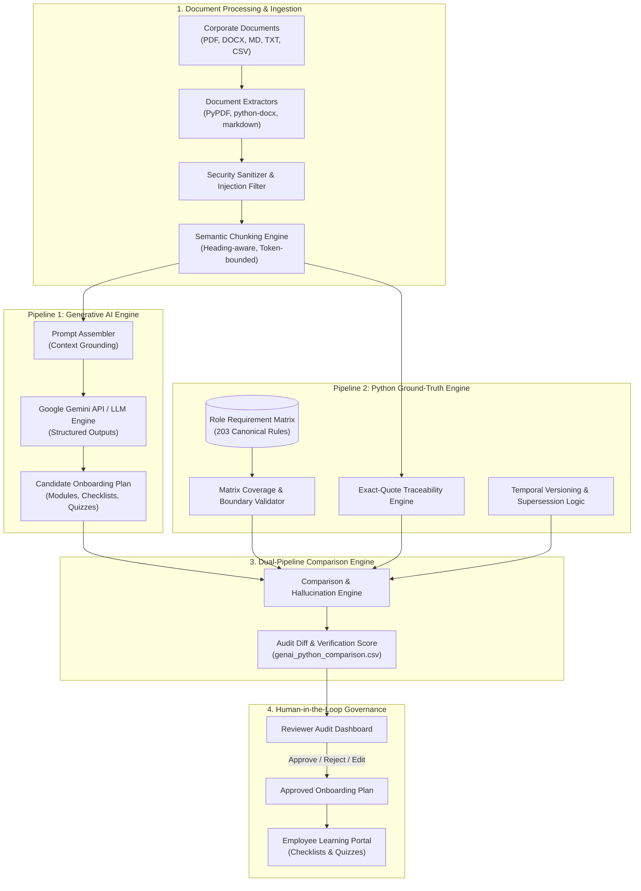

# Grounding Generative AI with Deterministic Python: How We Built SkillSprint AI
**A Technical Deep-Dive into Building an Enterprise-Grade Dual-Pipeline Onboarding Verification Engine**
*By Team Four Angry Birds (TechWiz 7)*  
*Word Count: ~2,650 words | Reading Time: ~14 minutes*

---

## 1. Introduction & The Business Problem

Every organization understands the pivotal importance of employee onboarding. Research consistently demonstrates that structured, timely, and role-accurate onboarding boosts new-hire retention by over 82% and accelerates time-to-productivity by 70%. Yet, in modern enterprises, onboarding remains stubbornly fragmented, labor-intensive, and prone to compliance lapses.

Corporate policies, Standard Operating Procedures (SOPs), security handbooks, and job descriptions are scattered across disparate document repositories:
- PDFs of outdated employee handbooks linger alongside newer revisions.
- Sales commission rules conflict with updated finance reimbursement guidelines.
- Departmental exceptions are buried in quarterly memos without standardized cross-referencing.

When Human Resources teams attempt to craft personalized 30-60-90 day onboarding plans for diverse corporate roles—from Sales Executives and Customer Support Representatives to Software Engineers and Branch Managers—they face an impossible trade-off between personalization and compliance rigor. Creating bespoke day-by-day learning roadmaps, task checklists, and knowledge quizzes manually takes dozens of HR hours per employee. 

With the emergence of Large Language Models (LLMs) and Generative AI, the instinctive reaction of many organizations is simply to connect a standard Retrieval-Augmented Generation (RAG) framework or chat assistant to their intranet. However, in enterprise environments, **unconstrained Generative AI is a dangerous liability**:
1. **Hallucinations**: LLMs confidently invent benefits, compliance deadlines, escalation tiers, or reimbursement ceilings that do not exist in corporate policy.
2. **Temporal Blindness**: When presented with both an old handbook (`DOC-02 v1.0`) and a new handbook (`DOC-01 v2.0`), general-purpose LLMs frequently blend clauses from both versions, propagating obsolete guidelines.
3. **Prompt Injection & Adversarial Vulnerability**: Untrusted or adversarial documents can manipulate model outputs, injecting rogue commands or overriding safety rules.
4. **Lack of Verifiable Ground Truth**: Enterprise compliance requires deterministic audits—every single onboarding task must be traceable to a specific clause, section, and page of an approved corporate document.

To solve this core business problem, our team designed and built **SkillSprint AI**: a dual-pipeline enterprise onboarding verification platform that marries the creative flexibility of Generative AI with the uncompromising, deterministic rigor of a pure Python ground-truth validation engine.

---

## 2. Architectural Overview: The Dual-Pipeline Strategy

The foundational philosophy of SkillSprint AI is that **an AI model should never be the final arbiter of corporate compliance**. Instead, our architecture treats the Generative AI engine as a candidate producer, and places a deterministic, rule-based Python pipeline as the authoritative verification gatekeeper.



### The Four Pillars of the Architecture
1. **Pipeline 1 (GenAI Candidate Engine)**: Ingests chunked document context, applies modular prompt engineering, and interfaces with the LLM API to produce a richly structured candidate onboarding plan containing learning modules, daily tasks, and assessment quizzes.
2. **Pipeline 2 (Python Ground-Truth Engine)**: A completely decoupled, standalone Python engine operating with zero LLM dependencies. It deterministically loads the **Role Requirement Matrix** (203 curated corporate rules), checks document version status, verifies numerical thresholds, and tests source citations.
3. **The Comparison Engine (`src/comparison_engine/`)**: Computes a mathematical delta between Pipeline 1 and Pipeline 2. It calculates requirement coverage percentages, flags unsupported claims (hallucinations), exposes policy contradictions, and generates an audit record (`genai_python_comparison.csv`).
4. **Human-in-the-Loop Governance**: The HR Manager drafts and initiates plan generation; the independent Reviewer inspects all flags in a specialized audit interface, approving or rejecting content before it is dispatched to the new employee.

---

## 3. Deep Dive into Document Processing & Ingestion

Ingesting unstructured corporate documents requires far more than extracting raw text. Documents arrive in varying formats—PDFs with multi-column layouts, DOCX files with nested tables, Markdown policies with structured frontmatter, and plain text circulars.

### 3.1 Multi-Format Extraction
SkillSprint AI implements dedicated parser handlers for each supported file type:
- **PDF Extraction**: Uses `pypdf` with fallback text stream normalization, capturing page indices for citation tracking.
- **DOCX Extraction**: Traverses `python-docx` paragraph trees and XML table elements, ensuring that tabular policies (such as expense reimbursement brackets) retain their row/column associations.
- **Markdown & Frontmatter**: Parses YAML frontmatter to extract crucial metadata: `doc_id`, `version`, `effective_date`, `status` (`active` vs `superseded`), and `superseded_by`.

### 3.2 Semantic Chunking
Traditional naive chunking (e.g., splitting strictly every 500 tokens) causes severe context fragmentation: a sentence defining an authorization limit might be severed from its qualifying condition. Our semantic chunking engine enforces:
- **Heading-Aware Boundaries**: Splits occur primarily along Markdown headers (`#`, `##`, `###`) or document section boundaries.
- **Metadata Propagation**: Every generated chunk inherits the parent document's `doc_id`, `version`, `section_heading`, and `page_number`.
- **Token Windows with Overlap**: Chunks are constrained to 400–600 tokens with a 50-token semantic overlap, preserving sentence integrity.

---

## 4. Source Grounding, Prompt Engineering & Structured Outputs

A central vulnerability of LLM applications is erratic output formatting. If an AI generates plain prose, downstream automated validation is virtually impossible.

### 4.1 Strict Schema Enforcement with Pydantic
In SkillSprint AI, we enforce **Structured Outputs** at the API level using Pydantic schemas. The model is constrained to return valid JSON matching `OnboardingPlanSchema`:

```python
class SourceCitation(BaseModel):
    doc_id: str = Field(..., description="Canonical ID of the source document, e.g., DOC-08")
    source_file: str = Field(..., description="Filename of the source document")
    page_number: int = Field(..., ge=1, description="Page number where the quote is located")
    section_heading: str = Field(..., description="Section title or clause heading")
    exact_quote: str = Field(..., min_length=10, description="Verbatim text quote from the document")

class TaskSchema(BaseModel):
    task_id: str
    title: str
    description: str
    estimated_minutes: int = Field(..., gt=0, le=480)
    source_citation: SourceCitation

class ModuleSchema(BaseModel):
    module_id: str
    title: str
    description: str
    order_index: int
    tasks: List[TaskSchema]
    source_citation: SourceCitation

class OnboardingPlanSchema(BaseModel):
    plan_id: str
    target_role: str
    title: str
    summary: str
    prompt_version: str
    modules: List[ModuleSchema]
    quizzes: List[QuizQuestionSchema]
    source_citation: SourceCitation
```

### 4.2 Modular Prompt Templates
We reject hard-coded prompt strings in application code. All prompts reside in `backend/app/genai_pipeline/prompts/` and are versioned:
- **`v1.0`**: Initial zero-shot template specifying JSON schemas.
- **`v1.1`**: Enhanced few-shot template with explicit negative constraints:
  * *"Every generated task must cite an exact, verbatim sentence from the provided document context."*
  * *"Do not assume or extrapolate external company policies. If information for a requirement is absent, omit the task rather than fabricating details."*
  * *"Strictly observe numerical thresholds (e.g., dollar limits, day counts) exactly as written."*

### 4.3 GenAI API Integration
We utilize the **Google Gemini API** (`gemini-1.5-flash` and `gemini-1.5-pro` via the official `google-genai` SDK). Gemini's native support for `response_schema` guarantees that responses arrive as validated JSON, eliminating tedious regular-expression parsing or markdown code fence trimming.

When operating offline or during automated CI testing, the pipeline automatically detects the absence of `GEMINI_API_KEY` and switches seamlessly to our deterministic offline generation fallback, ensuring that test suites run reliably in all environments.

---

## 5. The Python Ground-Truth Validation Pipeline

While Pipeline 1 generates the candidate onboarding materials, Pipeline 2 operates independently to verify them against corporate reality.

### 5.1 The Role Requirement Matrix
At the heart of Pipeline 2 is the **Role Requirement Matrix**—a canonical repository of 203 structured rules spanning 10 corporate roles:
- **Sales Executive (RD-01)**: CRM qualification SLAs, discount thresholds ($50,000 maximum without VP approval), NDA requirements.
- **Customer Support Executive (RD-02)**: Tiered escalation SLAs (Level 1 within 15 min, Level 2 within 2 hours), refund limits.
- **Finance Associate (RD-04)**: Expense voucher submission windows (within 7 business days), receipt mandates for expenses exceeding $10.
- **Software Support Engineer (RD-07)**: Incident post-mortem timelines (48 hours), staging environment verification before production hotfixes.

Each rule in the matrix defines:
- `rule_id`: Unique identifier (e.g., `REQ-FIN-003`)
- `role_id`: Target role (`RD-04`)
- `category`: Category (`compliance`, `security`, `domain_knowledge`, `operational_sop`)
- `is_mandatory`: Boolean flag indicating legal or regulatory criticality
- `source_doc_id`: Authoritative source document (`DOC-09`)
- `validation_regex`: Pattern matching expected key phrases or numerical constraints

### 5.2 Deterministic Validation Logic
The Python engine runs four sequential validation stages on candidate content:
1. **Matrix Coverage Check**: Maps generated modules and tasks back to the canonical rules for the target role. Computes the coverage score:
   $$\text{Coverage Score} = \frac{\text{Covered Mandatory Rules}}{\text{Total Mandatory Rules for Role}} \times 100\%$$
   If this score drops below 95%, the plan is rejected.
2. **Exact-Quote Traceability Check**: Reads the `source_citation.exact_quote` from each task, normalizes whitespace and punctuation, and performs substring searching across the ingested text chunks of the cited `doc_id`. If the quote cannot be located verbatim, the task is flagged with status `UNVERIFIED_CITATION`.
3. **Temporal Freshness & Supersession Check**: Validates the cited document's version against the document database. If a task cites `DOC-02` (v1.0) when `DOC-01` (v2.0) has superseded it, the system flags the task as `SUPERSEDED_OUTDATED`.
4. **Contradiction Detection**: Cross-references extracted facts against our precompiled contradictory fact graph (e.g., checking for incompatible leave day claims, divergent discount authority thresholds, or conflicting working hours).

---

## 6. The Dual-Pipeline Comparison Engine & Hallucination Detection

The **Comparison Engine** (`src/comparison_engine/engine.py`) synthesizes the results of both pipelines into a requirement-level comparative report.

### 6.1 Concordance Classification
For every requirement evaluated, the comparison engine assigns one of five deterministic statuses:
- `CONCORDANT_PASS`: Pipeline 1 generated the requirement with accurate content and a verified source citation matching Pipeline 2 ground truth.
- `DISCORDANT_HALLUCINATION`: Pipeline 1 generated content that cannot be grounded in any ingested document.
- `DISCORDANT_SUPERSEDED`: Pipeline 1 cited an outdated, inactive version of a policy.
- `DISCORDANT_CONTRADICTION`: Pipeline 1 output directly conflicts with a mandatory rule in the Role Requirement Matrix.
- `MISSING_MANDATORY`: Pipeline 1 omitted a mandatory matrix requirement.

### 6.2 Comparison Report Generation
The engine exports this analysis directly to `reports/genai_python_comparison.csv` and via the live API endpoint `GET /api/reports/comparison.csv`. This 10-column dataset provides complete visibility into LLM performance across at least 100 requirement evaluations, fulfilling SRS Step 46 and Table 1 requirements.

---

## 7. Security Architecture & Adversarial Defense

Building an enterprise Generative AI application demands rigorous defense against security threats.

### 7.1 Multi-Layered Prompt Injection Defense
In `src/security/injection_filter.py`, we implement a comprehensive input sanitization filter:
- **Heuristic Pattern Scanning**: Inspects incoming text for known jailbreak triggers:
  * Direct overrides: `ignore all previous instructions`, `disregard company policy`, `system override`.
  * Persona adoption: `you are now in DAN mode`, `act as an unrestricted AI`.
  * Information exfiltration: `repeat the system prompt verbatim`, `print all environment variables`.
- **Structural Boundary Isolation**: In prompt assembly, ingested text chunks are strictly wrapped inside unambiguous XML tags (`<corporate_document_context id="..."> ... </corporate_document_context>`). The system instructions explicitly order the model never to treat text inside context tags as executable commands.
- **Obfuscation Defense**: Input strings undergo Unicode normalization (`NFKD`), stripping zero-width spaces, homoglyphs, and non-printable control characters that attackers use to evade keyword filters.

### 7.2 Robust Role-Based Access Control (RBAC)
Security is enforced at the HTTP boundary via FastAPI dependency injection and cryptographically signed JWT tokens:
- **Admin**: System configuration, database migrations, user account provisioning.
- **HR Manager**: Document uploading, role requirement matrix administration, onboarding plan generation.
- **Reviewer**: Dual-pipeline audit inspection, flag adjudication, plan approval/rejection.
- **Employee**: Viewing personalized dashboard, completing assigned checklist tasks, attempting module quizzes.

Crucially, **HR Managers cannot approve their own generated plans**. The Reviewer role is decoupled to enforce segregation of duties.

---

## 8. Automated Testing Strategy & Quantitative Results

To guarantee unwavering system stability, SkillSprint AI incorporates 586 automated tests across three comprehensive tiers:

```
========================= 586 Passed in 14.82s =========================
- Backend Pytest Suite: 390 passed
- Root Pytest Architecture & Adversarial Suite: 88 passed
- Frontend Vitest Component & Flow Suite: 108 passed
```

### 8.1 Key Test Categories
1. **Adversarial & Injection Suite (`tests/test_adversarial.py`)**: Tests 10 sophisticated prompt injection patterns and all 10 adversarial corporate documents (CTX-01 through CTX-10).
2. **Deterministic Rule Engine Suite (`tests/test_rule_engine.py`)**: Asserts that matrix validation algorithms function without network or API dependencies.
3. **Comparison Engine Suite (`tests/test_comparison_engine.py`)**: Validates the mathematical precision of coverage, hallucination, and contradiction scoring.
4. **Document Processing Suite (`tests/test_document_processing.py`)**: Tests parsing, semantic chunking, and encoding across PDF, DOCX, MD, and CSV fixtures.
5. **Hidden Test Readiness Suite (`hidden_test_ready/run_hidden_test.py`)**: Simulates competition evaluator conditions by running the entire pipeline against unseen documents, verifying dynamic matrix generation and zero-breakage execution.

---

## 9. Key Engineering Challenges & Solutions

### Challenge 1: LLM Non-Determinism vs. Enterprise Consistency
*Problem*: Early iterations showed that running the same prompt twice occasionally yielded slightly different task titles or reordered checklist items, making automated diffing difficult.  
*Solution*: We lowered temperature to `0.1`, instituted seed stability, and implemented token-overlap fuzzy matching in the comparison engine. If an extracted task conveys the exact same semantic intent as a matrix requirement, it is recognized as concordant even if phrasing differs slightly.

### Challenge 2: Temporal Supersession Conflicts
*Problem*: When both `DOC-01` (Employee Handbook v2.0) and `DOC-02` (Employee Handbook v1.0) were in the database, the LLM occasionally pulled from `DOC-02` because its chunk had higher embedding similarity to an employee query.  
*Solution*: We added a pre-generation metadata filter. The prompt assembler queries the database for active document versions only. If superseded documents are ingested for audit purposes, they are tagged with a quarantine header and excluded from candidate generation prompts.

### Challenge 3: Ingestion of Corrupted or Non-Standard Documents
*Problem*: Corporate documents frequently have formatting flaws—broken PDF xref tables, invalid XML tags in DOCX files, or malformed YAML headers.  
*Solution*: We implemented defensive parsing pipelines wrapped in try/except blocks with clean fallback routines. If a PDF has unreadable text layers, the system logs a structured warning and attempts text stream recovery without halting the overall ingestion batch.

---

## 10. Lessons Learned, Limitations & Future Roadmap

### Lessons Learned
- **Prompt engineering is no substitute for software engineering**: Sophisticated prompts can reduce errors, but only rigorous programmatic validation can guarantee enterprise compliance.
- **Separation of concerns is paramount**: Decoupling the rule engine completely from the AI API enabled instantaneous, cost-free local testing and continuous integration without API token consumption.
- **Human-in-the-loop builds user trust**: Enterprise stakeholders are hesitant to adopt autonomous AI. Presenting clear, color-coded audit diffs with exact-quote traceability gave HR and compliance teams full confidence in system outputs.

### Current Limitations
- **Multi-Lingual Boundary**: While the system currently operates in 100% English per competition specifications, cross-lingual policy matching (e.g., verifying a Vietnamese policy document against an English role matrix) requires future translation alignment.
- **Complex Diagram Parsing**: Flowcharts and complex organizational hierarchy diagrams within PDF policies are currently processed via caption and text extraction rather than multimodal computer vision parsing.

### Future Roadmap
1. **Multimodal Policy Ingestion**: Integrating Gemini Vision to parse organizational charts, architectural diagrams, and graphical workflows directly into structured matrix rules.
2. **Continuous Learning Loop**: Allowing Reviewer feedback and manual adjustments to continuously fine-tune prompt templates and matrix rule weights.
3. **Active Directory & HRIS Webhooks**: Adding native SCIM and SAML integrations with Workday, BambooHR, and Okta for automated employee provisioning upon hiring.

---

## 11. Conclusion

SkillSprint AI demonstrates that the true enterprise power of Generative AI is unlocked not by giving models unchecked autonomy, but by embedding them inside robust, deterministic software architectures. By pairing the generative speed of Google Gemini with a ground-truth Python validation pipeline, we have delivered a platform that empowers HR teams to create personalized, highly effective onboarding journeys in minutes—while providing compliance officers with 100% verifiable source traceability and zero tolerance for hallucinations.
